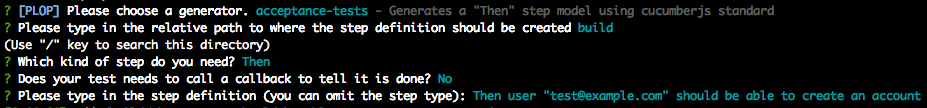

# ✨ plop - acceptance test steps
A generator to create step definitions for automated acceptance tests.



## Usage
1. Install plop globally:

`yarn global add plop` or `npm install -g plop`

2. Install `plop-acceptance-test-steps` in your project:

`yarn add --dev plop-acceptance-test-steps` or `npm install --save-dev plop-acceptance-test-steps`

3. Create a `plopfile.js` in the root folder of your project, and require `plop-acceptance-test-steps`:

```javascript
  module.exports = require('plop-acceptance-test-steps');
```

  or

```javascript
  const acceptanceTestsGenerator = require('plop-acceptance-test-steps');
  
  module.exports = function (plop) {
    ...
    acceptanceTestsGenerator(plop);
    ...
  };
```

## Scenario name template

To generate a step definition file, first, follow the instructions above. Then when the generator asks you for the step definition, just type it in the same way you'd add it to your `.feature`. e.g:

> Then user "test@example.com" should be able to create an account

or

> Then the user account should have 1.25 credits

There is one special case though, when you wanna restrict the text argument to specific choices, in that case, you should use the pattern below:

> Then the user account [can|cannot] create an account

## Contributing 💪
To contribute, please open an issue or file a PR.

## License
MIT
